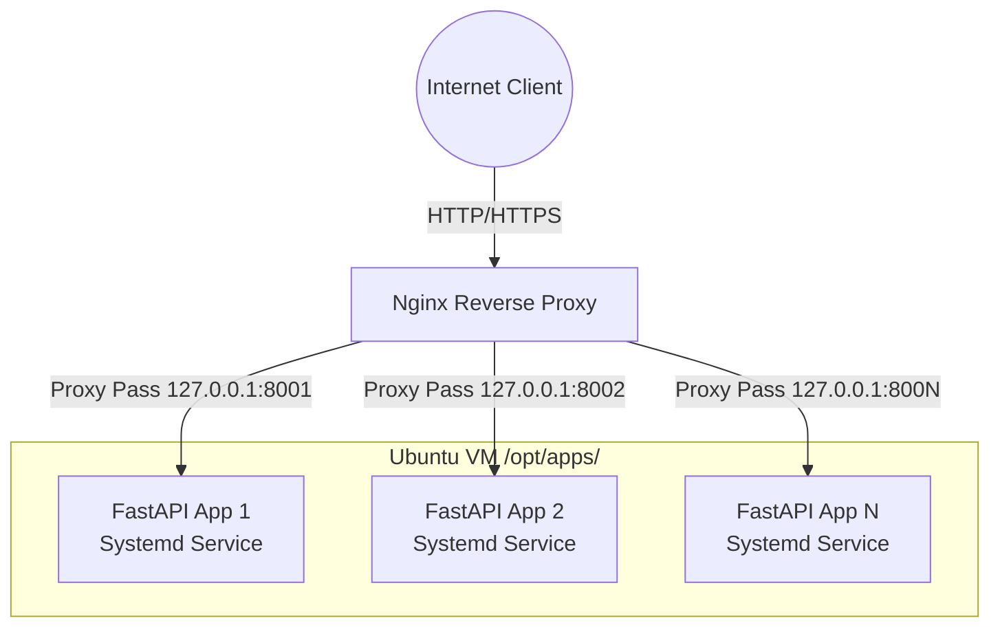

# 🚀 FastAPI Multi-App Platform


A production-grade, self-hosted Platform as a Service (PaaS) to deploy multiple isolated FastAPI applications on a single Ubuntu Virtual Machine. This platform automates provisioning, reverse proxy configuration via Nginx, process management via systemd, dynamic DNS using DuckDNS, and continuous deployment via GitHub Actions.

---

## 📖 Table of Contents

- [Architectural Overview](#-architectural-overview)
- [Key Features](#-key-features)
- [Prerequisites](#-prerequisites)
- [Platform Initialization](#-platform-initialization)
- [Application Deployment Contract](#-application-deployment-contract)
- [Platform Usage](#-platform-usage)
  - [Creating an App](#creating-an-app)
  - [Deleting an App](#deleting-an-app)
- [Continuous Integration & Deployment (CI/CD)](#-continuous-integration--deployment-cicd)
- [Security & SSL](#-security--ssl)
- [Troubleshooting & Debugging](#-troubleshooting--debugging)
- [Design Principles](#-design-principles)

---

## 🧱 Architectural Overview



Each application is thoroughly isolated by:

- A unique internal port
- An independent systemd service
- A dedicated GitHub repository
- A dedicated DuckDNS subdomain

---

## ✨ Key Features

- **Multi-tenant deployment:** Host unlimited FastAPI applications on one VM.
- **Zero-touch reverse proxying:** Nginx configurations are dynamically generated.
- **Process Management:** Fully managed application lifecycle through systemd.
- **Automated DNS:** Seamless integration with DuckDNS for dynamic subdomains.
- **GitOps Ready:** Out-of-the-box support for CI/CD workflows utilizing GitHub Actions.
- **Automated SSL:** Easily secure endpoints via Let's Encrypt (Certbot).

---

## 🛠️ Prerequisites

### Infrastructure Requirements

- **OS:** Ubuntu 20.04 LTS or newer (tested on AWS, Oracle Cloud, DigitalOcean).
- **Network:** Ingress enabled for Ports `22` (SSH), `80` (HTTP), and `443` (HTTPS).

### Dependency Installation

Ensure your VM is up to date and has the required foundational packages installed:

```bash
sudo apt update
sudo apt install -y git curl nginx python3 python3-venv build-essential
```

Enable and start Nginx:

```bash
sudo systemctl enable nginx
sudo systemctl start nginx
```

---

## 🚀 Platform Initialization

### 1. Directory Structure Standards

Enforce a clean layout for applications and automation scripts:

```bash
sudo mkdir -p /opt/apps /opt/automation
sudo chown -R ubuntu:ubuntu /opt/apps /opt/automation
```

**Layout Overview:**

```text
/opt
├── apps/                 # Application deployments
│   └── <app-name>/       # Individual app (venv, run script, source code)
└── automation/           # Core platform scripts (create_app.sh, delete_app.sh)
```

### 2. DuckDNS Configuration

Configure dynamic DNS for free subdomain provisioning.

1. Register at [DuckDNS](https://duckdns.org) and create a base domain (e.g., `rceus.duckdns.org`).
2. Store your DuckDNS token securely on the VM:

```bash
sudo mkdir -p /etc/letsencrypt
echo "dns_duckdns_token = YOUR_DUCKDNS_TOKEN" | sudo tee /etc/letsencrypt/duckdns.ini > /dev/null
sudo chmod 600 /etc/letsencrypt/duckdns.ini
```

---

## 🤝 Application Deployment Contract

Every FastAPI repository deployed on this platform **must** adhere to a minimal structural contract to ensure automated provisioning operates flawlessly.

### Required Files

- `requirements.txt`: Must include `fastapi` and `uvicorn`.
- `src/app/main.py`: The entry point for the FastAPI application.

### Minimal `main.py` Example

```python
from fastapi import FastAPI

app = FastAPI()

@app.get("/")
def root():
    return {"message": "FastAPI application is operational"}

@app.get("/health")
def health():
    return {"status": "healthy"}
```

---

## ⚙️ Platform Usage

The platform uses centralized bash scripts (`/opt/automation/`) acting as the single source of truth for provisioning and tearing down applications.

### Creating an App

The `create_app.sh` script automates the creation of the application directory, virtual environment, systemd service, Nginx configuration, and DuckDNS subdomain registration.

**Usage:**

```bash
sudo /opt/automation/create_app.sh <github-repo-name> <internal-port>
```

**Example:**

```bash
sudo /opt/automation/create_app.sh python-fastapi-template 8002
```

_Your application will instantly become available at: `http://fastapi-template.your-domain.duckdns.org`_

### Deleting an App

The `delete_app.sh` script provides a safe teardown of the application, removing its systemd service, Nginx server blocks, and directory artifacts.

**Usage:**

```bash
sudo /opt/automation/delete_app.sh <github-repo-name>
```

---

## 🔄 Continuous Integration & Deployment (CI/CD)

Automate deployments so that a `git push` to the `main` branch seamlessly updates the live application.

### GitHub Actions Workflow

Create `.github/workflows/deploy.yml` in your application repository:

```yaml
name: Deploy FastAPI App

on:
  push:
    branches: [main]

jobs:
  deploy:
    runs-on: ubuntu-latest
    steps:
      - name: Deploy via SSH
        uses: appleboy/ssh-action@v1
        with:
          host: ${{ secrets.VM_HOST }}
          username: ubuntu
          key: ${{ secrets.VM_SSH_KEY }}
          script: |
            cd /opt/apps/<github-repo-name>
            git pull origin main
            sudo systemctl restart <github-repo-name>
```

**Required GitHub Repository Secrets:**

- `VM_HOST`: The public IP or DNS of your Ubuntu VM.
- `VM_SSH_KEY`: A private SSH key authorized to access the `ubuntu` user on the VM.

---

## 🔐 Security & SSL

To bring the platform up to full production readiness, endpoints should be secured using SSL/TLS via Let's Encrypt.

### Install Certbot

```bash
sudo snap install core
sudo snap install --classic certbot
sudo ln -s /snap/bin/certbot /usr/bin/certbot
```

### Issue SSL Certificate

```bash
sudo certbot --nginx -d <app-name>.your-domain.duckdns.org
```

Certbot will automatically configure Nginx to route traffic over HTTPS and set up a systemd timer (`systemctl list-timers | grep certbot`) to renew the certificates autonomously.

---

## 🧪 Troubleshooting & Debugging

When an application fails to start or route correctly, utilize the following diagnostic commands:

- **Verify Application Status:**
  ```bash
  sudo systemctl status <app-name>
  ```
- **Check Port Bindings:** Ensure the app is listening on the assigned port.
  ```bash
  sudo ss -lntp | grep <port>
  ```
- **Validate Nginx Configuration:** Check for syntax errors or conflicting server names.
  ```bash
  sudo nginx -T | grep conflicting
  ```
- **Find Duplicate Domains:**
  ```bash
  grep -R "<domain>" /etc/nginx/sites-enabled
  ```

---

## 📐 Design Principles

To maintain platform stability, strictly adhere to these rules:

1. ❌ **Never** manually create or edit Nginx configurations. Use the automation scripts.
2. ✅ **Always** ensure a 1:1 mapping: One Repo = One Service = One Port = One Nginx Config.
3. ❌ **Never** reuse internal ports across different applications.
4. ✅ Route isolation is handled by the Nginx `server_name` directive, utilizing distinct subdomains per app.
